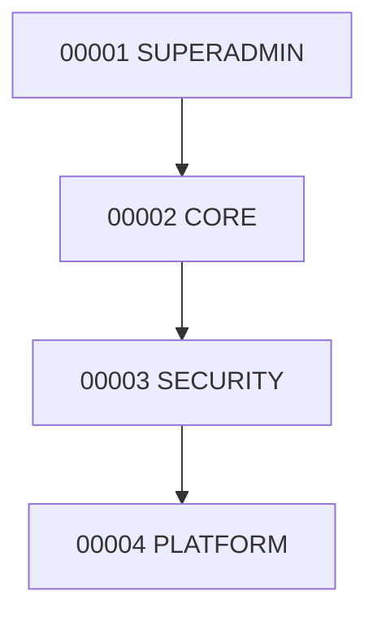

# Dependências de Migrations — GhostWritter

Fonte operacional do grafo de pacotes da trilha **core** (banco GH).  
Convenções de criação/validação: [`MIGRATIONS_MASTER_REFERENCE.md`](./MIGRATIONS_MASTER_REFERENCE.md).  
Deploy automatizado: **`gh-infra/scripts/deploy-migrations.ps1`** / **`deploy-migrations.sh`**
(delega para `gh-migrations/scripts/migration_deployer_python.py`).

---

## Princípios

1. **Ordem estrita por sequência** (`NNNN` no nome `PKG_{ENV}_V1_{NNNN}_{SCHEMA}`).
2. Um pacote **só** pode ser aplicado se todas as deps diretas (e transitivas) estiverem `completed` em `superadmin.migrations` — exceto o pacote zero (`00001_SUPERADMIN`), que cria essa tabela.
3. Prefixo de ambiente (`DSV` / `HMG` / `PRD`) **não** muda a sequência nem o schema; só o ambiente alvo.
4. **Lote** = pasta de data `DD.MM.YYYY` (um dia de release). Dentro do lote, ainda se aplica na ordem `NNNN`.
5. Arquivos SQL **dentro** de um pacote rodam em ordem lexicográfica (`01-…`, `02-…`).

---

## Grafo DSV atual (bootstrap 07.08.2026)



| Seq | Pacote | Schema principal | Depende de | Motivo |
|-----|--------|------------------|------------|--------|
| 00001 | `PKG_DSV_V1_00001_SUPERADMIN` | `superadmin` | — | Extensões, histórico de migrations, `log_migration_step` |
| 00002 | `PKG_DSV_V1_00002_CORE` | `core` | 00001 | Users/companies/workspaces; registra em `superadmin.migrations` |
| 00003 | `PKG_DSV_V1_00003_SECURITY` | `security` | 00002 | RBAC/sessions; FKs para `core.users` / `core.companies` |
| 00004 | `PKG_DSV_V1_00004_PLATFORM` | `platform` (+ EXP security) | 00003 | Obra literária sob `core.workspaces`; `02-SECURITY-EXP` → `security.log_events` |

Path físico:

```text
migrations/core/desenvolvimento/2026/Agosto/07.08.2026/
  PKG_DSV_V1_00001_SUPERADMIN/
  PKG_DSV_V1_00002_CORE/
  PKG_DSV_V1_00003_SECURITY/
  PKG_DSV_V1_00004_PLATFORM/
```

Manifesto máquina: [`deps.manifest.json`](./deps.manifest.json).

---

## Dependências HMG / PRD

Mesma cadeia de schemas. Trocar apenas o prefixo:

| Ambiente | Prefixo | Pasta |
|----------|---------|-------|
| desenvolvimento | `DSV` | `migrations/core/desenvolvimento/` |
| homologação | `HMG` | `migrations/core/homologação/` |
| produção | `PRD` | `migrations/core/produção/` |

Ex.: `PKG_HMG_V1_00003_SECURITY` depende de `PKG_HMG_V1_00002_CORE` (não do pacote DSV).

---

## Dependências internas (arquivos no pacote)

| Pacote | Ordem de arquivos | Nota |
|--------|-------------------|------|
| SUPERADMIN | `01-SUPERADMIN-CRE.sql` | Único |
| CORE | `01-CORE-CRE.sql` | Único |
| SECURITY | `01-SECURITY-CRE.sql` | Único |
| PLATFORM | `01-PLATFORM-CRE.sql` → `02-SECURITY-EXP.sql` | EXP exige tabelas platform + security |

Rollbacks: ordem inversa (`92` antes de `91` quando ambos existirem).

---

## Modos de deploy

| Modo | O que aplica | Uso típico |
|------|--------------|------------|
| **full** | Todos os pacotes pendentes do ambiente, em ordem `NNNN` | Bootstrap / CI DSV |
| **lote** | Pacotes de uma data `DD.MM.YYYY` (pendentes), em ordem | Release do dia |
| **last** | Só o pacote de maior `NNNN` ainda pendente (ou o último do disco se `-Force`) | Hotfix isolado |
| **package** | Um pacote nominal (`PKG_…` ou sufixo `SECURITY` / `00003`) | Reaplicar / smoke pontual |

Flags comuns:

- `-DryRun` / `--dry-run` — lista SQL sem executar
- `-Force` / `--force` — não pula `completed`
- `-Env` / `--env` — default `desenvolvimento`

Exemplos:

```powershell
cd gh-infra
.\scripts\deploy-migrations.ps1 -Mode full -Env desenvolvimento
.\scripts\deploy-migrations.ps1 -Mode lote -Date 07.08.2026
.\scripts\deploy-migrations.ps1 -Mode last
.\scripts\deploy-migrations.ps1 -Mode package -Package PKG_DSV_V1_00004_PLATFORM
.\scripts\deploy-migrations.ps1 -Mode package -Package 00003 -DryRun
```

```bash
cd gh-infra
./scripts/deploy-migrations.sh full --env desenvolvimento
./scripts/deploy-migrations.sh lote --date 07.08.2026
./scripts/deploy-migrations.sh last
./scripts/deploy-migrations.sh package PKG_DSV_V1_00004_PLATFORM
```

---

## Como evoluir o grafo

Ao criar `PKG_*_V1_00005_…`:

1. Declarar deps no README do pacote (`## Dependências`).
2. Atualizar a tabela deste documento + `deps.manifest.json`.
3. Garantir FKs só para schemas já criados por deps.
4. Nunca editar pacote consolidado já aplicado em HMG/PRD — abrir novo `NNNN`.

---

## Verificação pós-deploy

```sql
SELECT package_name, status, environment, created_at
FROM superadmin.migrations
ORDER BY package_name;
```

Deployer também consulta status antes de aplicar (pula `completed` salvo `-Force`).
